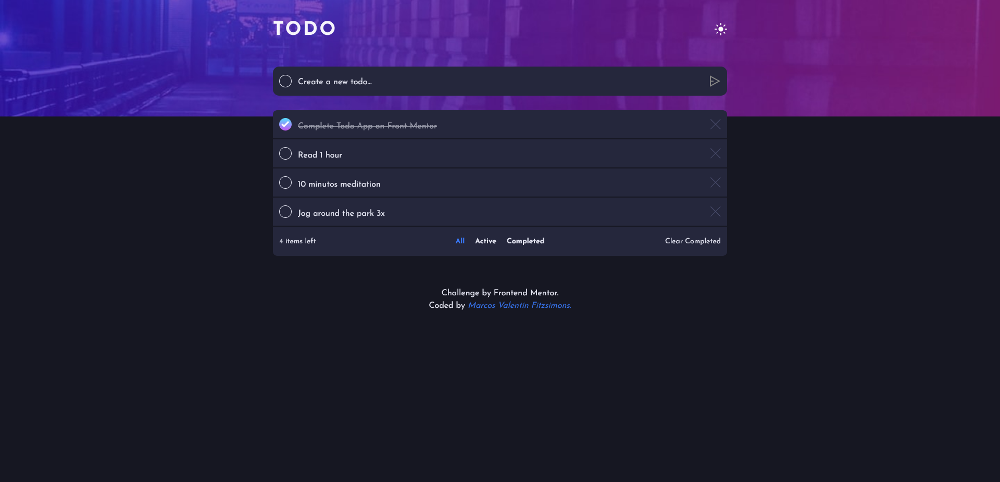

# Frontend Mentor - Todo App solution

This is a solution to the [Todo app challenge on Frontend Mentor](https://www.frontendmentor.io/challenges/todo-app-Su1_KokOW). Frontend Mentor challenges help you improve your coding skills by building realistic projects.

## Table of contents

- [Overview](#overview)
  - [The challenge](#the-challenge)
  - [Screenshot](#screenshot)
  - [Links](#links)
- [My process](#my-process)
  - [Built with](#built-with)
  - [What I learned](#what-i-learned)
- [Author](#author)

## Overview

### The challenge

Users should be able to:

- View the optimal layout for the app depending on their device's screen size
- See hover states for all interactive elements on the page
- Add new todos to the list
- Mark todos as complete
- Delete todos from the list
- Filter by all/active/complete todos
- Clear all completed todos
- Toggle light and dark mode

### Screenshot



### Links

- Solution URL: [Add solution URL here](https://your-solution-url.com)
- Live Site URL: [Add live site URL here](https://todo-react-app-pi.vercel.app/)

### Built with

- Semantic HTML5 markup
- CSS custom properties
- Flexbox
- Mobile-first workflow
- [React](https://reactjs.org/) - JS library
- [TailwindCSS](https://tailwindcss.com/) - For styles

### What I learned

-How to manage the data inside an array of objects with methods like .map & .filter.

-How to filter data depending on a specific state, using an switch statement.

```js
const filterHandler = () => {
  switch (status) {
    case "Completed":
      setFilteredTodos(todos.filter((todo) => todo.completed === true));
      break;
    case "Active":
      setFilteredTodos(todos.filter((todo) => todo.completed === false));
      break;
    default:
      setFilteredTodos(todos);
      break;
  }
};
```

-How to use the localStorage to save the changes in my todoList.

```js
useEffect(() => {
  getLocalTodos();
}, []);

useEffect(() => {
  filterHandler();
  saveLocalTodos();
}, [todos, status]);

const saveLocalTodos = () => {
  localStorage.setItem("todos", JSON.stringify(todos));
};

const getLocalTodos = () => {
  if (localStorage.getItem("todos") === null) {
    localStorage.setItem("todos", JSON.stringify([]));
  } else {
    let todoLocal = JSON.parse(localStorage.getItem("todos"));
    setTodos(todoLocal);
  }
};
```

How to add transitions easily to my app with: [Auto animate](https://auto-animate.formkit.com/)

How to generate a random ID with: [UUID](https://github.com/uuidjs/uuid)

How to create notifications with: [React hot toast](https://react-hot-toast.com/)

## Author

- Website - [Marcos Fitzsimons](https://marcosfitzsimons-portfolio.vercel.app/)
- Frontend Mentor - [@Marcosfitzsimons](https://www.frontendmentor.io/profile/Marcosfitzsimons)
